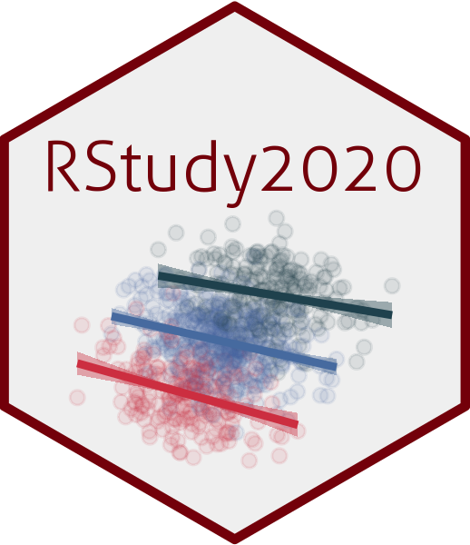

# Rstudy2020: R로 배우는 기초통계

이 레포지토리는 [Rstudy2020](https://rstudy2020.netlify.app) 활동을 위해 작성된 코드 등을 공유하기 위해 만들어진 공간입니다. 

## Theme

이 사이트는 Hugo와 [Andrew Heiss's](https://andrewheiss.com)가 커스텀한 [테마](https://github.com/andrewheiss/ath-tufte-hugo_18-19), 그리고 [Juan Fernando Tellez](https://juanftellez.com/)의 디자인을 참조하여 재구성되었습니다.
